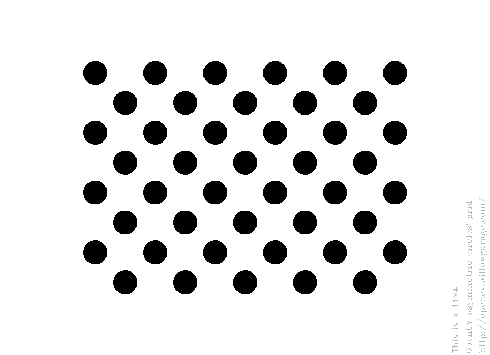

# ArUco
ArUco detection android app. 
The app is implemented using OpenCV android camera helper library. `android.hardware.camera2` libary is indirectly used via JavaCamera2View class. 

# Build setting
The current version is tested for Google Pixel 3a with the following build configuration.
- OpenCV SDK 4.3.0 (build with contributed libraries, can be downloaded from https://www.dropbox.com/s/94gzml6et54slc5/install.zip?dl=0)
- NDK 20.1.5948944
- Android sdk version 29
- Android Studio 3.6.3

Inside `gradle.properties`, the path `opencvsdk=` should be properly modified to indicate the folder in which sdk folder is located.

# How to use
- The app automatically detects the ArUco markers and displays the marker boundaries. 
- The app doesn't support the pose estimiation until the camera calibration is done. In order to perform the camera calibration, capture the following image with the button at the bottom right corner. If the calibration fails, you will see the error message.

- Once the camera calibartion is done, the app also displays three axes of the estimated poses upon marker detection.
